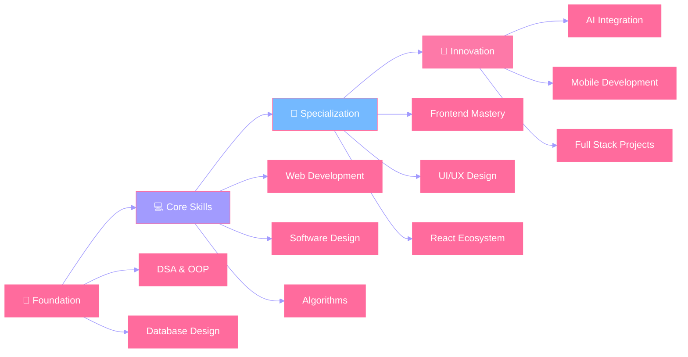
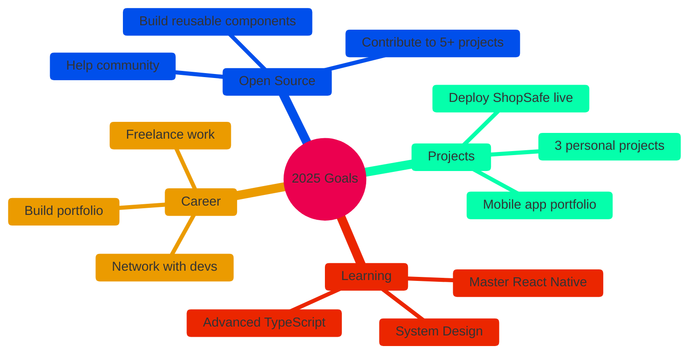

<div align="center">

# ✨ Welcome to My Digital Canvas ✨


### 💫 Frontend Developer | UI/UX Enthusiast | Creative Problem Solver

<p align="center">
  
</p>

[](mailto:hadiasarwar786@gmail.com)
[](#)
[](#)


</div>

---

## 🎨 About Me


**👋 Hi! I'm Hadia Sarwar**

🎓 Software Engineering student at **FAST-NUCES, Lahore**  
💖 Passionate about **Frontend Development** and creating beautiful user experiences  
🎨 I specialize in building **responsive, visually appealing** interfaces  
🌍 Based in **Lahore, Pakistan 🇵🇰**

**🛠️ What I Do:**
- 🎨 Frontend Development with React, JavaFX & Tailwind
- 💻 Full-stack applications using MERN stack
- 📱 Mobile app development with React Native
- 🤝 Team collaboration and UI/UX design

**📚 Currently:**
- 🚀 Learning React Native & AI Integration
- 🛡️ Building ShopSafe - Pakistan's Trust Platform
- 🔍 Exploring Advanced Design Patterns

<br clear="right"/>

> 💡 **Fun Fact:** I believe every pixel matters! My code is as clean as my UI designs 🎯

---

## 🌈 My Tech Palette

<div align="center">

### 🎨 Frontend Magic
<p>
  
</p>

### ⚙️ Backend & Tools
<p>
  
</p>

### 💻 Languages I Speak
<p>
  
</p>

### 🎯 Special Skills
<p>
  
  
</p>

</div>

---

## 🚀 Featured Projects

<div align="center">

<table>
<tr>
<td width="50%">

### 🛡️ ShopSafe
**Pakistan's E-Commerce Trust Platform**

🎯 **My Role:** Full Stack Development  
💡 **Tech:** React, Node.js, MongoDB, AI/ML  
✨ **Features:** Fake Review Detection, Sentiment Analysis, Multilingual Support

**Highlights:**
- AI-powered trust scoring system
- Support for English, Urdu & Roman Urdu
- Real-time review verification

[View Project →](https://github.com/Hadia-Sarwar/ShopSafe)

</td>
<td width="50%">

### 🐾 Compawnion
**Pet Adoption & Community Platform**

🎯 **My Role:** Frontend Lead  
💡 **Tech:** React, Tailwind, Express, MongoDB  
✨ **Features:** Pet Profiles, Adoption Flow, Community

**Highlights:**
- Beautiful, responsive UI design
- Intuitive user experience
- Real-time shelter interactions

[View Project →](https://github.com/Hadia-Sarwar/Compawnion)

</td>
</tr>

<tr>
<td width="50%">

### 🎨 UML Diagram Editor
**Interactive Design Tool**

🎯 **My Role:** Frontend & UI/UX  
💡 **Tech:** JavaFX, TypeScript, CSS  
✨ **Features:** Drag & Drop, Export, Responsive Canvas

**Highlights:**
- Smooth drag-and-drop interface
- Clean, modern UI design
- Pixel-perfect layouts

[View Project →](https://github.com/Hadia-Sarwar/UML_Diagram_Editor)

</td>
<td width="50%">

### 🚨 Disaster Detection App
**AI-Powered Safety System**

🎯 **My Role:** Mobile UI Development  
💡 **Tech:** React Native, Node.js, Python  
✨ **Features:** Real-time Alerts, Safety Tips, AI Detection

**Highlights:**
- Intuitive mobile interface
- Precaution module design
- Emergency notification system

[View Project →](https://github.com/Hadia-Sarwar/Disaster-Detection-App)

</td>
</tr>
</table>

</div>

---

## 💼 What Makes Me Different

<div align="center">

<table>
<tr>
<td align="center" width="33%">


### 🎨 Design-First Mindset
I don't just code interfaces—I craft experiences. Every component is thoughtfully designed with the user in mind.

</td>
<td align="center" width="33%">


### 💡 Creative Problem Solver
I approach challenges with creativity and logic, finding elegant solutions to complex problems.

</td>
<td align="center" width="33%">


### 🤝 Team Collaborator
I thrive in team environments, bringing frontend expertise while seamlessly integrating with backend developers.

</td>
</tr>
</table>

</div>

---

## 🎓 Learning Journey

<div align="center">



</div>

---


<div align="center">

### 💪 Expertise Level

```text
Frontend Development    ████████████████████░   95%
UI/UX Design           ███████████████████░░   90%
React & Tailwind       ██████████████████░░░   85%
Backend Integration    ████████████████░░░░░   75%
JavaFX & Desktop Apps  ████████████████░░░░░   80%
Database Management    ███████████████░░░░░░   70%
Mobile Development     ██████████████░░░░░░░   65%
```

</div>

---

## 🏆 Experience Highlights

<div align="center">

| 💼 Experience | 🎯 Impact | 🛠️ Skills Used |
|:---:|:---:|:---:|
| **Frontend Development** | Led UI/UX for 4+ projects | React, Tailwind, JavaFX |
| **Freelance Translator** | WordPress multilingual content | Communication, Attention to Detail |
| **Team Projects** | Collaborated on complex systems | Git, Teamwork, Leadership |
| **Academic Projects** | Built 10+ full-stack applications | Problem Solving, Clean Code |

</div>

---

## 📚 Currently Exploring

<div align="center">

<table>
<tr>
<td align="center" width="25%">


**React Native**
Building cross-platform mobile apps

</td>
<td align="center" width="25%">


**Advanced Patterns**
State management & optimization

</td>
<td align="center" width="25%">


**AI Integration**
Connecting frontend with ML models

</td>
<td align="center" width="25%">


**System Design**
Scalable architecture patterns

</td>
</tr>
</table>

</div>

---

## 🎯 2025 Goals

<div align="center">



</div>

---

## 🎨 Design Philosophy

<div align="center">


### ✨ I believe in...

**🎯 User-Centric Design** • **💡 Simplicity Over Complexity** • **🎨 Attention to Detail**

**🚀 Performance Matters** • **♿ Accessibility First** • **📱 Mobile-First Approach**

</div>

---

## 💌 Let's Create Something Amazing Together!

<div align="center">

 **I'm always excited to collaborate on interesting projects!** 

Whether you need a beautiful frontend, want to discuss tech, or just want to connect—feel free to reach out!

### 📫 Get in Touch

[](mailto:hadiasarwar786@gmail.com)
[](https://github.com/Hadia-Sarwar)
[](https://github.com/Hadia-Sarwar)


### 💭 Favorite Quote

*"Design is not just what it looks like and feels like. Design is how it works."*  
— Steve Jobs


</div>
